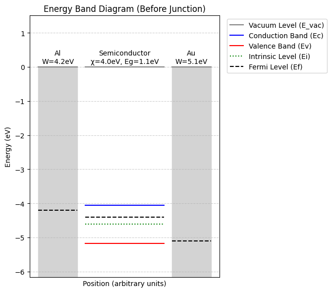
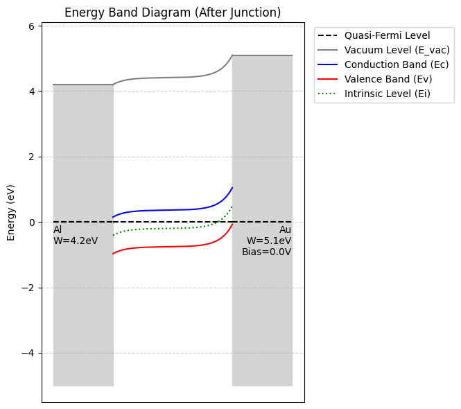

# MSM Band Diagram Plotter

This project provides a tool to calculate and plot the energy band diagram of a Metal-Semiconductor-Metal (MSM) structure. It can be used as a command-line interface (CLI) or a graphical user interface (GUI).

## Features

-   **MSM Band Diagram Calculation**: Calculates the band structure for an MSM device, including effects like band bending and applied bias.
-   **Before and After Junction Views**: Visualize the band diagrams of the individual materials before they form a junction, and the complete band diagram after the junction is formed.
-   **Interactive GUI**: An easy-to-use graphical interface to manipulate parameters and see the results in real-time.
-   **Command-Line Interface**: A flexible CLI for scripting and batch processing.
-   **Configurable Parameters**: Easily configure physical parameters through a JSON file or command-line arguments.
-   **Save to File**: Save the generated band diagram to an image file.



## Limitations

- This tool does not include a feature to calculate the depletion width.
- Therefore, applying a bias may not produce realistic results.

## Requirements

The project requires the following Python libraries:

-   `matplotlib`
-   `numpy`

You can install them using pip:

```bash
pip install -r requirements.txt
```

## How to Use

### Graphical User Interface (GUI)

To run the GUI, execute the following command:

```bash
python run_gui.py
```

The GUI allows you to interactively change the parameters and see the updated plot.

### Command-Line Interface (CLI)

To run the CLI, use the `run_cli.py` script. You can pass parameters either through a JSON configuration file or directly as command-line arguments.

#### Example

1.  **Using a configuration file:**

    Create a `config.json` file:

    ```json
    {
      "chi": 4.0,
      "eg": 1.12,
      "fermi_shift": 0.2,
      "wf_left": 4.5,
      "label_left": "Metal 1",
      "wf_right": 4.8,
      "label_right": "Metal 2",
      "bias": 0.5,
      "output": "band_diagram.png"
    }
    ```

    Then run the CLI:

    ```bash
    python run_cli.py --json config.json
    ```

2.  **Using command-line arguments:**

    ```bash
    python run_cli.py --chi 4.0 --eg 1.12 --fermi-shift 0.2 --wf-left 4.5 --wf-right 4.8 --bias 0.5 --output band_diagram.png
    ```

    To see the plot before junction formation:

    ```bash
    python run_cli.py --view before --output band_diagram_before.png
    ```

## Configuration Parameters

-   `chi`: Electron affinity of the semiconductor (in eV).
-   `eg`: Band gap of the semiconductor (in eV).
-   `fermi_shift`: Position of the Fermi level relative to the intrinsic level in the semiconductor (in eV). Positive for n-type, negative for p-type.
-   `wf_left`: Work function of the left metal (in eV).
-   `label_left`: Label for the left metal.
-   `wf_right`: Work function of the right metal (in eV).
-   `label_right`: Label for the right metal.
-   `bias`: Applied bias voltage (in V).
-   `output`: (CLI only) Path to save the output image file. If not provided, the plot will be displayed in a window.
-   `view`: (CLI only) The view to display. Can be `before` or `after` junction formation. Defaults to `after`.